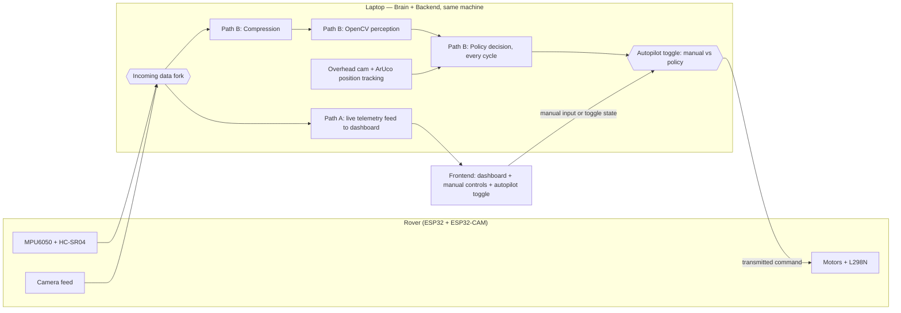
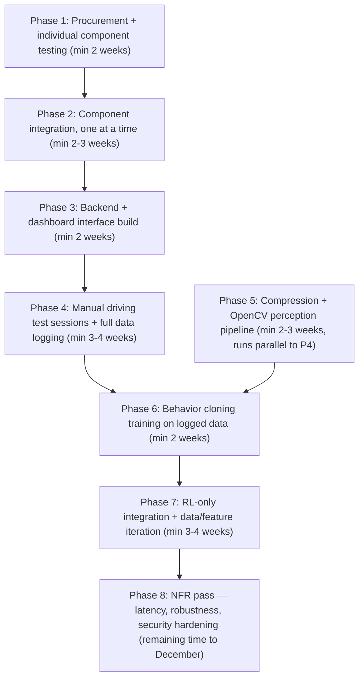

# The Self-Driving Rover: Learning to Navigate From Its Own Mistakes

## 1. What This Is, and Why We're Building It

This project is a small wheeled rover that learns to drive itself. Not through hardcoded if-else obstacle avoidance, but through a policy trained on real driving data we generate ourselves, paired with a computer vision pipeline so it actually understands what's in front of it rather than just reacting to distance readings.

Concretely: we manually drive the rover around, log every sensor reading, camera frame, and motor command while we do it, then train a policy (starting with behavior cloning) to imitate that driving. In parallel, OpenCV handles perception, an image compression stage makes that perception pipeline faster and lighter, and a low-latency backend ties the whole control loop together in something close to real time, with a web dashboard for live monitoring and manual override.

The motivation isn't "solve a real-world problem." It's that this project forces genuine engineering across every layer, embedded hardware with real constraints, computer vision that has to work on a moving platform, an RL/imitation-learning pipeline that has to survive contact with messy real-world data, and a systems/backend layer where latency actually matters instead of being an academic afterthought. If it ends up solving something real or becomes patent-worthy later, that's a bonus. The requirement is that all four of us come out the other side having built something we couldn't have built in October.

## 2. What We Need the Hardware to Actually Do

Before picking parts, here's what the hardware has to be capable of, independent of which specific components we land on:

- **Locomotion**: drive forward, reverse, and turn on the spot or in an arc, on an indoor floor surface (tile/smooth concrete), reliably enough to repeat the same commanded path multiple times without wildly different outcomes.
- **Obstacle sensing**: detect an object at close range (roughly 5cm to 2m) fast enough that the rover can react before collision at low speed (walking pace, not high speed).
- **Orientation sensing**: know its own tilt/orientation well enough to detect if it's stuck, tipped, or spinning its wheels without moving.
- **Vision**: capture a video feed good enough for both obstacle/object detection and for an overhead camera to track the rover's position via a marker.
- **Communication**: stream sensor + video data out, and receive motor commands back, over WiFi, with round-trip latency low enough that manual driving doesn't feel laggy (target: keep this under ~150-200ms round trip as a first goal, tighten later).
- **Power**: run untethered for at least a full test session (30-45 minutes) without needing a battery swap mid-test.
- **Timing**: the reflex layer on the rover itself (stop-if-too-close type safety behavior) needs to react in low tens of milliseconds, independent of whatever the network/brain round trip is doing, so a stuck WiFi connection doesn't mean a rover that drives into a wall.

Nothing above names a part yet, it's just what any hardware we choose has to satisfy.

## 3. Recommended Hardware, Cost, and Where to Buy It

Architecture note that drives these choices: the rover itself only needs to execute motor commands, read sensors, and stream video, it is not running OpenCV or the RL policy on-device. Those run on a laptop acting as the "brain." This matters a lot for cost, it means we don't need a Jetson Nano or anything with real onboard compute (which would blow past ₹5k on its own), an ESP32-class microcontroller is enough.

| Component | Role | Approx. Price (INR) | Source |
|---|---|---|---|
| ESP32 Dev Board | Main controller — reads sensors, drives motors, runs the local safety-stop reflex | ₹280–360 | Robu.in, Robokits.co.in, Robocraze |
| ESP32-CAM (OV2640/OV3660) | Dedicated video streaming module | ₹400–700 | Robu.in, Robocraze |
| 2WD chassis kit (acrylic chassis + 2x TT gear motors + L298N driver + battery holder + wheels) | Locomotion, bundled | ₹500–750 | Robokreeda, Robocraze, Robu.in |
| MPU6050 IMU module | Orientation/tilt sensing | ₹100–175 | Robocraze, Robokits.co.in |
| HC-SR04 ultrasonic sensor ×2 | Close-range obstacle detection, front + one angled side | ₹70–120 each (~₹150–240 total) | Robocraze, indiamart sellers |
| Jumper wires, breadboard, mounting screws, spare battery cells | Assembly/misc | ₹200–350 | Any of the above |
| **Estimated total** | | **~₹1,600–2,600** | |

This leaves real headroom inside the ₹3-5k budget, deliberately. Reasons to keep it, not spend it immediately: expect at least one component to die or misbehave during the "test everything individually" phase (this is normal with cheap sensor modules), and you'll likely want a second HC-SR04 or an extra battery pack once you're doing real test sessions. Don't buy the second unit of anything until the first one has survived a week of testing.

The overhead camera for position tracking (see Section 5) doesn't need a separate purchase, an existing laptop webcam pointed down at the test area works fine for this.

**On not building in a hardware ceiling.** Fair concern, and cheap here means "matches exactly what's needed today," which is exactly what turns into a wall the moment you want to bolt something on later. Three concrete adjustments that cost little now but buy real headroom later:
- **Motors with torque margin, not the bare minimum.** The default TT gear motors in most bundle kits are sized for the chassis weight alone. If there's any chance of adding a second sensor deck, a small arm, or anything with real mass later, size the motors for meaningfully more than today's payload, this is the cheapest insurance in the whole build, a few extra rupees per motor now versus a full motor swap later.
- **Chassis with spare mounting holes and a bit of unused deck space**, not one sized exactly to today's parts. Most of the bundle kits already have extra mounting holes (the Robokreeda one does), just don't pick the most minimal/compact chassis option if a slightly larger one is available at similar price.
- **ESP32 with GPIO headroom left unused.** Standard ESP32 dev boards have plenty of pins beyond what today's sensor set needs, don't route the design so tightly that every pin is spoken for, leave room to add a sensor without a controller swap.

One honest question back before locking this: what kind of future addition is actually on your mind, more sensors, a small mechanical add-on, something else? "Strong enough to hold future changes" without knowing which changes is a real risk of over-building the base for a modification that never comes, versus under-building for the one that does. The three adjustments above are cheap enough to do regardless, but if you have something specific in mind, it'd change the chassis/motor choice more concretely.

One honest caveat: these are current listed prices from the sources above at time of writing, not a locked quote, prices on these sites move with stock and offers. Worth a quick recheck before actually ordering.

## 4. Tech Stack, Libraries, and Skills Needed

**On the rover (ESP32, C/C++ via Arduino framework or ESP-IDF)**
- Arduino core for ESP32, or ESP-IDF directly if we want more control (ESP-IDF is more work but avoids Arduino's abstraction overhead, worth it for Adarsh/Abhinav's low-latency interest specifically)
- WiFi + WebSocket client library (arduinoWebSockets or similar) for the primary data link
- Basic PWM motor control (native ESP32 LEDC peripheral)

**On the "brain" (laptop, Python to start, optimize later if needed)**
- OpenCV (`opencv-python`) for perception and for reading the overhead camera feed
- An image compression step before frames go anywhere over the network (start simple: JPEG quality tuning + resolution scaling before OpenCV even touches the frame; this alone is often the single biggest latency win)
- ArUco marker detection (`cv2.aruco`, built into OpenCV) for position tracking off the overhead webcam
- PyTorch or a lightweight alternative for the behavior cloning model, PyTorch has better documentation and community support for anyone new to this
- PyBullet (free) for the simulation environment, if/when simulation work starts

**Backend**
- Python (FastAPI or similar) to start for correctness, with WebSocket support for the two real-time links (rover↔backend, backend↔frontend)
- Profile before optimizing, don't pre-optimize the backend in C++ before you know where the actual bottleneck is

**Web dashboard**
- A simple frontend framework (React is fine, nothing fancy needed) for live telemetry visualization, manual override controls, and video feed display
- A charting library (recharts or similar) for live sensor/latency graphs

**Skills to actively build across the team**
- Basic embedded C/C++ and serial/WiFi debugging (everyone, but especially whoever owns hardware)
- OpenCV fundamentals: contour detection, color segmentation, camera calibration, ArUco usage
- Imitation learning basics: what behavior cloning actually is, why it's brittle, what DAgger is for later
- WebSocket programming on both client and server side
- Git discipline, this is a 4-person project across hardware and software simultaneously, branch/merge discipline matters more here than in a typical single-stack project

## 5. Data Flow

Text description first, in case the diagram below doesn't render cleanly wherever this document is opened:

There are only two hardware blocks: the rover, and the laptop. The laptop runs both the "brain" logic (compression, OpenCV, policy) and the "backend" logic (command arbitration, serving the dashboard) as separate processes or threads on the same machine, not two separate computers.

The rover sends sensor readings and camera frames to the laptop over one connection. On arrival, that incoming data forks into two paths that run concurrently via multi-threading, neither one waits on the other:
- **Path A (monitoring)**: raw/lightly-processed sensor data and video go straight to the frontend dashboard for live viewing.
- **Path B (decision)**: the same data goes through compression → OpenCV perception → the policy, which produces a decision every single cycle, regardless of whether the rover is currently being driven manually or autonomously. The policy is never idle.

The overhead webcam (ArUco tracking) feeds position data into this same decision path.

The actual choice of what to send the rover lives on the frontend, an autopilot toggle, operated by the user, like a pilot's autopilot switch. When the toggle is off, the user's manual control inputs are what get transmitted to the rover. When it's on, the backend transmits the policy's decision (from Path B) instead. Either way, Path B keeps computing in the background so switching autopilot on mid-run doesn't mean waiting for a decision, one is already there.

## 6. Phase Flow

Durations below are minimums, not deadlines, treat them as "this realistically takes at least this long," with real slack expected especially around sim-to-real and integration.

## 7. Research Delegation — Four Workstreams

Before locking anything above in, four things need real manual verification, not just my research. Divided so each person leans into what they've already said they're into, with a bias toward genuinely stretching them rather than staying comfortable:

**Workstream 1: Hardware validation & sourcing**
Verify the actual current prices and stock at the sources listed in Section 3, cross-check against at least one source not listed here (worth checking IndiaMART bulk sellers and Amazon.in directly too). Order one of each core component first, not the full set, and physically test: does the L298N reliably drive both motors, does the MPU6050 give sane readings over I2C, does the ESP32-CAM stream video without dropping frames over WiFi at typical classroom/home WiFi conditions. Flag anything that doesn't match spec before the group commits to the full bill of materials.

**Workstream 2: Backend architecture & real-time communication**
Dig into whether WebSocket is really the right call for both links (rover↔brain and backend↔frontend), or whether one of them is worth doing differently, benchmark actual round-trip latency on real hardware once Workstream 1 has parts in hand, don't trust datasheet numbers. Also nail down the command arbitration design concretely (where does the mode flag live, what happens on a dropped connection mid-manual-override) before Phase 3 starts, not during it.

**Workstream 3: Perception & compression pipeline**
Research what compression approach actually gets a good latency/quality tradeoff for OpenCV input specifically, not just "smaller file size," resolution scaling and JPEG quality are the obvious starting points but there may be something better suited to real-time robotics vision. Also scope what "detect an object" needs to mean in practice, classical OpenCV techniques versus a lightweight pretrained model, and what that decision costs in terms of the brain laptop's CPU load.

**Workstream 4: RL policy & simulation environment**
Get PyBullet (or an alternative, if research turns up something better suited) actually running and confirm it can simulate something close enough to the rover's real dynamics to be useful later. Research behavior cloning implementation specifics, what does the logged dataset need to look like structurally for training to actually work, and what's the realistic minimum amount of manual driving data needed before a BC policy is worth training at all.

Whoever takes each workstream should come back with what they actually found, including anything that contradicts what's written above, this document is a starting point, not gospel.

## 8. What We'll Have Achieved

By December, assuming the phased plan holds: a rover that can be driven manually through a live web dashboard with sensor and video telemetry streaming back in near real time, that has generated its own training dataset through that manual driving, and that runs a trained behavior-cloned policy capable of navigating on its own in the same kind of environment it was trained in, with a command arbitration system allowing a human to take back control at any point. On top of the working system, a hardened version with measured and improved control-loop latency, tested robustness to sensor noise and dropped connections, and a documented architecture that could act as the actual foundation for DAgger or RL fine-tuning if the group wants to keep pushing after the course requirement is met.

More importantly than the working rover itself: every person on the team will have shipped something genuinely difficult in their own area, embedded systems that actually work outside a tutorial, computer vision that has to survive real lighting and real motion blur, a real-time backend where latency isn't a toy number, and a first real attempt at getting a learned policy to work on physical hardware instead of just in simulation. That last part in particular is a well-known hard problem in robotics, getting even a basic version working is a legitimate accomplishment for a semester project.