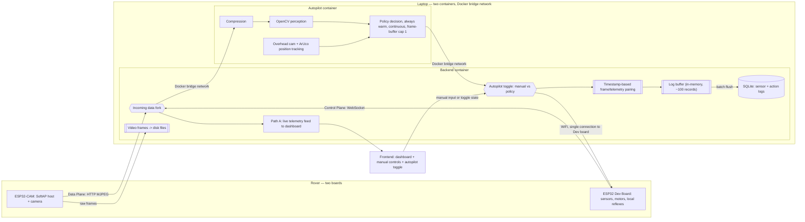
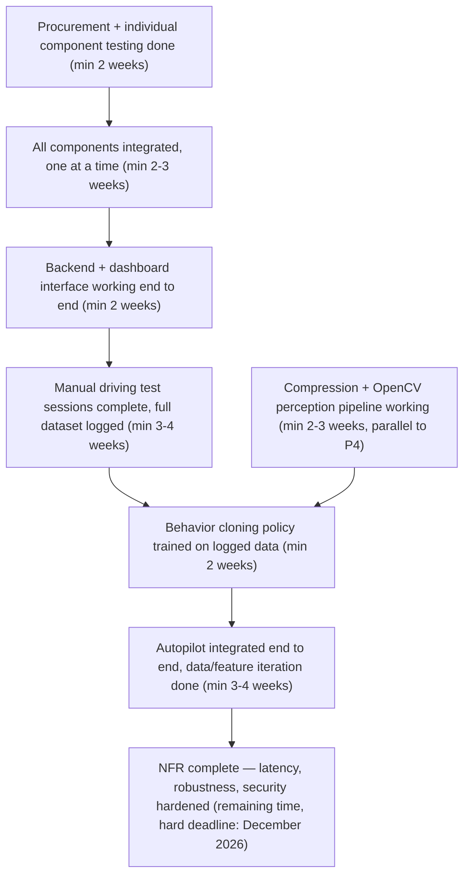

# The Self-Driving Rover: Learning to Navigate From Its Own Mistakes

## 1. What This Is, and Why We're Building It

This project is a small wheeled rover that learns to drive itself. Not through hardcoded if-else obstacle avoidance, but through a policy trained on real driving data we generate ourselves, paired with a computer vision pipeline so it actually understands what's in front of it rather than just reacting to distance readings.

Concretely: we manually drive the rover around, log every sensor reading, camera frame, and motor command while we do it, then train a policy (starting with behavior cloning) to imitate that driving. In parallel, OpenCV handles perception, an image compression stage makes that perception pipeline faster and lighter, and a low-latency backend ties the whole control loop together in something close to real time, with a web dashboard for live monitoring and manual override.

The motivation isn't "solve a real-world problem." It's that this project forces genuine engineering across every layer, embedded hardware with real constraints, computer vision that has to work on a moving platform, an RL/imitation-learning pipeline that has to survive contact with messy real-world data, and a systems/backend layer where latency actually matters instead of being an academic afterthought. If it ends up solving something real, that's a bonus. The requirement is that all four of us come out the other side having built something we couldn't have built when we started.

## 2. What We Need the Hardware to Actually Do

Before picking parts, here's what the hardware has to be capable of, independent of which specific components we land on:

- **Locomotion**: drive forward, reverse, and turn on the spot or in an arc, on an indoor floor surface (tile/smooth concrete), reliably enough to repeat the same commanded path multiple times without wildly different outcomes.
- **Obstacle sensing, two tiers**: close range (roughly 0-30cm) needs a purely local reaction, on the ESP32 itself, no network round trip, since the full Autopilot pipeline is structurally too slow to react before contact at this range. Mid range (roughly 30cm-2m) is where Autopilot's decision loop has time to actually matter for navigation choices like which way to turn.
- **Orientation sensing**: know its own tilt/orientation well enough to detect if it's stuck, tipped, or spinning its wheels without moving.
- **Vision**: capture a video feed good enough for both obstacle/object detection and for an overhead camera to track the rover's position via a marker.
- **Communication**: two separate planes, not one shared link. A **Control Plane** (persistent WebSocket) carries only small, urgent payloads, sensor readings and motor commands, and stays fast because nothing heavy shares it. A **Data Plane** (separate HTTP MJPEG stream) carries the camera feed, so a dropped or delayed video frame never blocks a driving command from getting through. Round-trip latency target on the Control Plane specifically: low double-digit ms, to be confirmed against real hardware once built, don't trust datasheet numbers. The **ESP32-CAM** hosts the SoftAP (capped at `max_connection = 2`, for exactly the ESP32 Dev Board and the laptop), the **ESP32 Dev Board** joins as a WiFi station client. WPA2-PSK on the network, an open network at a demo invites every nearby phone to auto-connect and add noise.
- **Power**: run untethered for at least a full test session (30-45 minutes) without needing a battery swap mid-test.
- **Timing**: two local reflexes on the rover, entirely independent of Autopilot or the network. One, proportional slow-down + stop-if-too-close, reacting in low single-digit milliseconds off raw ultrasonic readings. Two, a link-loss watchdog, if no heartbeat packet arrives within 300-500ms, cut motor power locally and auto-reconnect with exponential backoff, so a crashed laptop process or a dropped link never leaves the rover driving blind on a stale command.

Nothing above names a part yet, it's just what any hardware we choose has to satisfy.

## 3. Recommended Hardware, Cost, and Where to Buy It

Architecture note that drives these choices: the rover itself only needs to execute motor commands, read sensors, and stream video, it is not running OpenCV or the RL policy on-device. Those run on a laptop as the "Autopilot." This matters a lot for cost, it means we don't need a Jetson Nano or anything with real onboard compute (which would blow past ₹5k on its own), an ESP32-class microcontroller is enough.

| Component | Role | Approx. Price (INR) | Source |
|---|---|---|---|
| ESP32 Dev Board | Main controller — reads sensors, drives motors, runs the local safety-stop reflex | ₹280–360 | Robu.in, Robokits.co.in, Robocraze |
| ESP32-CAM (OV2640/OV3660) | Dedicated video streaming module | ₹400–700 | Robu.in, Robocraze |
| 2WD chassis kit (acrylic chassis + 2x TT gear motors + L298N driver + battery holder + wheels) | Locomotion, bundled | ₹500–750 | Robokreeda, Robocraze, Robu.in |
| MPU6050 IMU module | Orientation/tilt sensing | ₹100–175 | Robocraze, Robokits.co.in |
| HC-SR04 ultrasonic sensor ×2 | Close-range obstacle detection, front + one angled side | ₹70–120 each (~₹150–240 total) | Robocraze, indiamart sellers |
| Jumper wires, breadboard, mounting screws, spare battery cells | Assembly/misc | ₹200–350 | Any of the above |
| **Estimated total** | | **~₹1,600–2,600** | |

This leaves real headroom inside the ₹3-5k budget, deliberately. Reasons to keep it, not spend it immediately: expect at least one component to die or misbehave during the "test everything individually" phase (this is normal with cheap sensor modules), and you'll likely want a second HC-SR04 or an extra battery pack once you're doing real test sessions. Don't buy the second unit of anything until the first one has survived a week of testing.

The overhead camera for position tracking (see Section 5) doesn't need a separate purchase, an existing laptop webcam pointed down at the test area works fine for this.

**On not building in a hardware ceiling.** Fair concern, and cheap here means "matches exactly what's needed today," which is exactly what turns into a wall the moment you want to bolt something on later. Three concrete adjustments that cost little now but buy real headroom later:
- **Motors with torque margin, not the bare minimum.** The default TT gear motors in most bundle kits are sized for the chassis weight alone. If there's any chance of adding a second sensor deck, a small arm, or anything with real mass later, size the motors for meaningfully more than today's payload, this is the cheapest insurance in the whole build, a few extra rupees per motor now versus a full motor swap later.
- **Chassis with spare mounting holes and a bit of unused deck space**, not one sized exactly to today's parts. Most of the bundle kits already have extra mounting holes (the Robokreeda one does), just don't pick the most minimal/compact chassis option if a slightly larger one is available at similar price.
- **ESP32 with GPIO headroom left unused.** Standard ESP32 dev boards have plenty of pins beyond what today's sensor set needs, don't route the design so tightly that every pin is spoken for, leave room to add a sensor without a controller swap.

One honest question back before locking this: what kind of future addition is actually on your mind, more sensors, a small mechanical add-on, something else? "Strong enough to hold future changes" without knowing which changes is a real risk of over-building the base for a modification that never comes, versus under-building for the one that does. The three adjustments above are cheap enough to do regardless, but if you have something specific in mind, it'd change the chassis/motor choice more concretely.

One honest caveat: these are current listed prices from the sources above at time of writing, not a locked quote, prices on these sites move with stock and offers. Worth a quick recheck before actually ordering.

## 4. Tech Stack, Libraries, and Skills Needed

**On the rover — two boards, two distinct jobs (ESP32-CAM has too few usable GPIOs to also run motors/sensors, this split isn't optional)**
- Arduino core for ESP32, or ESP-IDF directly if we want more control (ESP-IDF is more work but avoids Arduino's abstraction overhead, worth it for Adarsh/Abhinav's low-latency interest specifically)
- **ESP32-CAM**: hosts the SoftAP (`max_connection = 2`), runs the camera, streams video out over a separate HTTP MJPEG connection, this is the Data Plane
- **ESP32 Dev Board**: joins the SoftAP as a WiFi station client, owns the sensors and motor PWM, runs the WebSocket Control Plane link, and both local reflexes (proximity slow-down/stop, and the link-loss heartbeat watchdog)
- WPA2-PSK on the SoftAP network
- Basic PWM motor control (native ESP32 LEDC peripheral)

**Two separate containers, both running on the same laptop:**

**Autopilot container**
- OpenCV (`opencv-python`) for perception and for reading the overhead camera feed
- An image compression step before frames go anywhere (start simple: JPEG quality tuning + resolution scaling before OpenCV even touches the frame; this alone is often the single biggest latency win)
- ArUco marker detection (`cv2.aruco`, built into OpenCV) for position tracking off the overhead webcam
- PyTorch or a lightweight alternative for the behavior cloning model, PyTorch has better documentation and community support for anyone new to this
- PyBullet (free) for the simulation environment, if/when simulation work starts
- **A frame buffer cap of 1**: if inference takes longer than a new frame takes to arrive, discard the queue and always process only the newest frame. Otherwise the policy ends up reacting to a stale frame, which shows up as delayed, laggy-feeling decisions.
- Only talks to Backend, over the Docker bridge network, addressed by container service name (e.g. `ws://autopilot:8001`), never touches the rover's network connection directly

**Backend container**
- Python (FastAPI or similar) to start for correctness, with WebSocket support for the Control Plane link (rover↔backend) and backend↔frontend, plus handling the MJPEG Data Plane stream
- This is the single point of contact for the rover, the rover only ever knows Backend's address, never Autopilot's
- Forwards incoming rover data to Autopilot over the Docker bridge network, receives its decision back, arbitrates it against manual input, sends the final command back to the rover
- **Timestamp-based frame/telemetry pairing**: since video and telemetry now travel as separate planes at different speeds, tag every incoming packet and frame with a capture timestamp, and only pair a driving action to an image if they arrived within a defined window of each other (discard the sample otherwise). Without this, logged training data silently pairs actions with the wrong frame.
- Profile before optimizing, don't pre-optimize in C++ before you know where the actual bottleneck is

**Data storage**
- SQLite for structured data: timestamped sensor readings, actions taken, run metadata, this is what the behavior cloning training pipeline reads from. File-based, no server to set up, appropriate for a single-laptop project.
- Recorded video/camera frames stay as files on disk, referenced by path/filename from rows in SQLite, don't store binary video inside the database itself
- **Writes are batched, not per-record.** At the rate data comes in during a manual driving session, writing to SQLite on every single record would mean constant disk I/O contending with everything else running. Instead, buffer incoming records in memory, and once a threshold is hit (start around 100 records), flush the whole batch to SQLite in one write. Fewer, larger writes beat many small ones, both simpler and faster here. Worth also flushing on session end regardless of whether the threshold was hit, so the last partial batch isn't lost.
- **The flush itself runs off the main loop**: use FastAPI's asyncio tasks for core driving logic, and offload each SQLite flush to a background thread-pool executor, with exactly one worker, so writes are always serialized. SQLite only tolerates one writer at a time regardless, a naive multi-threaded flush hits "database is locked" crashes; a single-worker executor avoids that by construction, and opening a fresh lightweight connection inside that background task avoids cross-thread connection crashes too.

**Web dashboard**
- A simple frontend framework (React is fine, nothing fancy needed) for live telemetry visualization, manual override controls, an autopilot toggle, and video feed display
- A charting library (recharts or similar) for live sensor/latency graphs

**Skills to actively build across the team**
- Basic embedded C/C++ and serial/WiFi debugging (everyone, but especially whoever owns hardware)
- OpenCV fundamentals: contour detection, color segmentation, camera calibration, ArUco usage
- Imitation learning basics: what behavior cloning actually is, why it's brittle, what DAgger is for later
- WebSocket programming on both client and server side
- Git discipline, this is a 4-person project across hardware and software simultaneously, branch/merge discipline matters more here than in a typical single-stack project

## 5. Data Flow

Text description first, in case the diagram below doesn't render cleanly wherever this document is opened:

There are two hardware boards on the rover (ESP32-CAM hosting the SoftAP + streaming video, ESP32 Dev Board handling sensors/motors/local reflexes) and one laptop running two containers, Backend and Autopilot. The rover has exactly one external network target, Backend, split into two planes: a Control Plane (WebSocket, sensor readings + motor commands) and a Data Plane (HTTP MJPEG, camera frames), so a slow or dropped video frame can never block a driving command.

**One correction worth being explicit about**: Backend and Autopilot are separate Docker containers, and separate containers do not share `localhost` by default, that was wrong in an earlier version of this plan. The actual fix is a Docker user-defined bridge network, with Backend addressing Autopilot by its container service name (`ws://autopilot:8001`) rather than `localhost`. This is still effectively free, latency-wise, traffic between two containers on the same host over a bridge network never touches physical hardware, still sub-millisecond, nowhere near WiFi's cost. Only the addressing mechanism changes, not the performance.

On arrival at Backend, incoming sensor/camera data forks into two paths that run concurrently via multi-threading, neither one waits on the other:
- **Path A (monitoring)**: raw/lightly-processed sensor data and video go straight to the frontend dashboard for live viewing.
- **Path B (decision)**: forwarded to Autopilot over the bridge network, where it goes through compression → OpenCV perception → the policy, which stays loaded in memory at all times and keeps producing a decision continuously. It is never cold-started, only idled, so there's no reload delay when switching back into autonomous mode. A frame-buffer cap of 1 inside Autopilot means it always reacts to the newest frame, never a stale queued one.

The overhead webcam (ArUco tracking) feeds position data into Autopilot as well.

Logging for training data happens in Backend, since that's where the actual arbitrated action (whichever source it came from) is decided, that's the (state, action) pair behavior cloning needs. Because video and telemetry now travel on separate planes at different speeds, every packet and frame gets a capture timestamp, and Backend only pairs an action to an image if they arrived within a defined time window of each other, discarding the sample otherwise, so training data never gets built from mismatched frame/action pairs. Rather than writing to SQLite on every record, incoming records go into an in-memory buffer first, and once it hits a threshold (~100 records), the whole batch gets flushed to SQLite in one write, off the main loop via a single-worker background thread so writes stay serialized and never block the control loop.

The actual choice of what to send the rover lives on the frontend, an autopilot toggle, operated by the user, like a pilot's autopilot switch. When the toggle is off, the user's manual control inputs are what get transmitted to the rover. When it's on, Backend transmits Autopilot's decision instead. Either way, Autopilot keeps computing in the background so switching it on mid-run doesn't mean waiting for a decision, one is already there.

**Prompt for regenerating this diagram elsewhere, if needed:**
"Draw a system architecture diagram. Hardware side: a 'Rover' with two boards, an ESP32-CAM (hosts a SoftAP WiFi network and streams camera video over a Data Plane HTTP MJPEG connection) and an ESP32 Dev Board (owns sensors and motors, runs local safety reflexes, communicates over a Control Plane WebSocket connection). Software side: a 'Laptop' running two Docker containers on a shared bridge network, a 'Backend container' (the rover's only external network target, receives both planes, forks data into a live-telemetry path to a frontend dashboard and a decision path forwarded to an 'Autopilot container' over the Docker bridge network by container service name, also does timestamp-based pairing of telemetry and video frames before logging them in batches of about 100 records to a SQLite database, with raw video frames written separately to disk files) and an 'Autopilot container' (runs compression, OpenCV perception, and a continuously-running policy with a frame-buffer cap of 1, also fed by an overhead webcam doing ArUco position tracking, sends its decision back to Backend over the bridge network). The frontend has manual controls plus an autopilot toggle; Backend arbitrates between manual input and Autopilot's decision and sends only the final command back to the ESP32 Dev Board over the single WiFi connection."

## 6. Phase Flow

Each step below is framed as a feature/milestone with a minimum duration, not a calendar date, treat the durations as "this realistically takes at least this long," with real slack expected especially around sim-to-real and integration. The one fixed calendar point is the final deadline: **all functional and non-functional work complete by December 2026.**

**Prompt for regenerating this diagram elsewhere, if needed:**
"Draw a top-to-bottom flowchart of 8 sequential feature milestones, each labeled with a minimum duration in weeks, not calendar dates: 1) Procurement and individual component testing done (2 weeks minimum), 2) All components integrated one at a time (2-3 weeks minimum), 3) Backend and dashboard interface working end to end (2 weeks minimum), 4) Manual driving test sessions complete with full dataset logged (3-4 weeks minimum), 5) Compression and OpenCV perception pipeline working, running in parallel with milestone 4 (2-3 weeks minimum), 6) Behavior cloning policy trained on the logged data, depending on both milestones 4 and 5 (2 weeks minimum), 7) Autopilot integrated end to end with data/feature iteration done (3-4 weeks minimum), 8) Non-functional requirements complete: latency, robustness, security hardened, using all remaining time up to a hard deadline of December 2026. Show milestone 5 as a parallel branch alongside milestone 4, both feeding into milestone 6."

## 7. Research Delegation — Four Workstreams

Before locking anything above in, four things need real manual verification, not just my research. Divided so each person leans into what they've already said they're into, with a bias toward genuinely stretching them rather than staying comfortable:

**Workstream 1: Hardware validation & sourcing**
Verify the actual current prices and stock at the sources listed in Section 3, cross-check against at least one source not listed here (worth checking IndiaMART bulk sellers and Amazon.in directly too). Order one of each core component first, not the full set, and physically test: does the L298N reliably drive both motors, does the MPU6050 give sane readings over I2C, does the ESP32-CAM stream video without dropping frames over WiFi at typical classroom/home WiFi conditions. Flag anything that doesn't match spec before the group commits to the full bill of materials.

**Workstream 2: Backend architecture & real-time communication**
Dig into whether WebSocket is really the right call for both links (rover↔backend and backend↔frontend), or whether one of them is worth doing differently, benchmark actual round-trip latency on real hardware once Workstream 1 has parts in hand, don't trust datasheet numbers. Also nail down the command arbitration design concretely (where does the mode flag live, what happens on a dropped connection mid-manual-override) before the interface-build milestone starts, not during it.

**Workstream 3: Perception & compression pipeline**
Research what compression approach actually gets a good latency/quality tradeoff for OpenCV input specifically, not just "smaller file size," resolution scaling and JPEG quality are the obvious starting points but there may be something better suited to real-time robotics vision. Also scope what "detect an object" needs to mean in practice, classical OpenCV techniques versus a lightweight pretrained model, and what that decision costs in terms of the Autopilot container's CPU load.

*Evaluated and rejected*: a proposed spectral/1D-array compression scheme that skipped standard 2D decode entirely. Real issues, not just an execution gap: its own benchmark numbers showed a larger payload than plain JPEG at similar quality, it produces a representation OpenCV's pixel-space tools (including ArUco detection, which position tracking depends on) can't consume, meaning a human-viewable frontend feed would need a second, separate JPEG encode running alongside it anyway, doubling work instead of saving it. Worth remembering as a category of proposal to stay skeptical of going forward: reproduce any striking benchmark numbers with an actual local test before adopting, especially ones claiming near-zero cost for something (like decode, or encryption) that always costs something in a real system.

**Workstream 4: RL policy & simulation environment**
Get PyBullet (or an alternative, if research turns up something better suited) actually running and confirm it can simulate something close enough to the rover's real dynamics to be useful later. Research behavior cloning implementation specifics, what does the logged dataset need to look like structurally for training to actually work, and what's the realistic minimum amount of manual driving data needed before a BC policy is worth training at all.

Whoever takes each workstream should come back with what they actually found, including anything that contradicts what's written above, this document is a starting point, not gospel.

## 8. What We'll Have Achieved

By December 2026, assuming the phased plan holds: a rover that can be driven manually through a live web dashboard with sensor and video telemetry streaming back in near real time, that has generated its own training dataset through that manual driving, and that runs a trained behavior-cloned policy capable of navigating on its own in the same kind of environment it was trained in, with a command arbitration system allowing a human to take back control at any point. On top of the working system, a hardened version with measured and improved control-loop latency, tested robustness to sensor noise and dropped connections, and a documented architecture that could act as the actual foundation for DAgger or RL fine-tuning if the group wants to keep pushing after the course requirement is met.

More importantly than the working rover itself: every person on the team will have shipped something genuinely difficult in their own area, embedded systems that actually work outside a tutorial, computer vision that has to survive real lighting and real motion blur, a real-time backend where latency isn't a toy number, and a first real attempt at getting a learned policy to work on physical hardware instead of just in simulation. That last part in particular is a well-known hard problem in robotics, getting even a basic version working is a legitimate accomplishment for a semester project.

## 9. Future Improvement (Deferred, Not Current Baseline): ESP-NOW Base Station

Current hardware and network plan (Sections 2-5) stays as-is. This section exists so the option is documented and ready, not because it's being built now.

**When to actually use this**: only if the Control Plane's standard WiFi round-trip latency, once actually measured on real hardware, turns out to be the genuine bottleneck, and software-side fixes (Section 4's frame-buffer cap, profiling and optimizing the Backend/Autopilot code path, tightening the WebSocket message format) have already been tried and haven't closed the gap. This is a hardware escalation for a measured problem, not a preemptive upgrade.

**Tests to run before considering this, in order:**
1. Benchmark actual Control Plane round-trip latency on real hardware, under normal SoftAP WiFi, once the rover and Backend are both built and integrated. Not a datasheet number, a measured one.
2. If that number misses the target, profile the software path first, confirm the delay is actually in the network hop and not in Backend/Autopilot processing time, encoding, or the arbitration logic. Cutting a software bottleneck is cheaper and faster than adding hardware.
3. Only once WiFi itself is confirmed as the bottleneck, prototype the ESP-NOW link on the bench, isolated from the rest of the system, and measure its actual total path latency, not just the radio hop.

**Exact hardware needed:** one additional ESP32 Dev Board (~₹370-400), used as a stationary base station, connected to the laptop over USB-serial (921,600 baud). This is on top of the existing two-board rover setup, not a replacement for either.

**What changes architecturally if adopted:** the ESP32 Dev Board on the rover (motors/sensors) switches from WebSocket-over-WiFi to ESP-NOW, talking directly to the new stationary base station board instead of the laptop. The base station relays that telemetry to Backend over the wired USB-serial connection. The ESP32-CAM's video stream is unaffected, it keeps using standard WiFi/SoftAP for the Data Plane, this change is scoped to the Control Plane only.

**Cost/complexity this adds, honestly:**
- ~₹370-400 for the extra board
- A USB cable tether between the laptop and the (stationary) base station, acceptable since the laptop isn't meant to be mounted on the moving rover anyway, but worth knowing it's not fully cable-free
- The reported ~1-5ms figure for ESP-NOW is the radio hop only, total latency including USB-serial driver overhead is unmeasured until step 3 above is actually done
- A real, if manageable, RF interference risk between the ESP-NOW radio and the WiFi radio operating close together on the same moving rover, needs empirical distance testing on the bench, not assumed safe
- If the ESP32-CAM's video-streaming compute load ends up causing jitter (worth watching for once integrated), AP-hosting duty can shift to the Dev Board instead, or video resolution/frame rate can drop, cheaper fallbacks than adding more hardware
